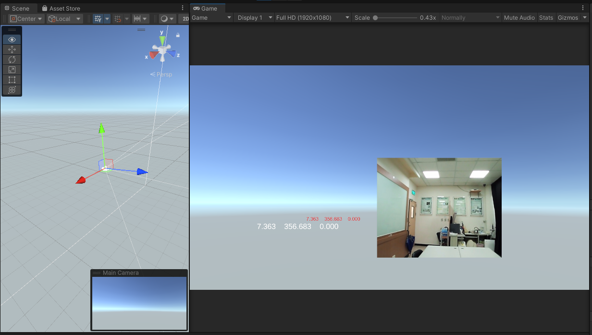
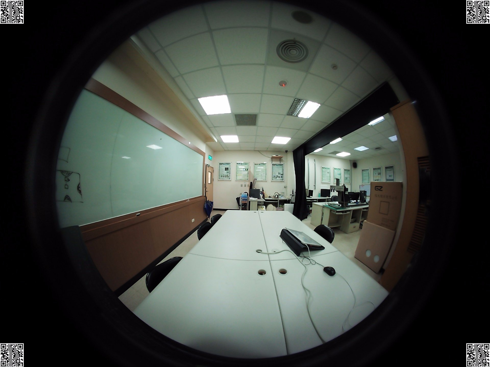

# UnityMoil

Using of MOIL dll in a Unity Project. The virtual camera rotation is controlled by the VR/MR headset. 

Views in Unity

The source fisheye image: 

1. Create a new Unity 3D Project

2. Put Lab.jpg under your Unity Project 

3. Copy the following files to  Assets\ folder under Unity Project 

    - MoilDll.dll

    - MoilDll.pdb

    - Emgu.CV.World.dll

    - show_cam.cs
   
    - cvextern.dll
 
4. Add the following GameObjects, adjust size and positions.
 
    1. GameObject/ UI/ Canvas

    2. GameObject/ UI/ Panel (Disable)

    3. GameObject/ UI/ Image

        Set properties, 

        PosX=240, PosY=-145

        Width=200, Height=160

        ScaleX=3, ScaleY=3

    4. GameObject/ UI/ Text-TextMeshPro

        Set properties, 

        PosX= -150, PosY=-200

        Width=500, Height= 30

        Text=MOIL

        Font Size=24

        Color = Red

5. Select Main Camera, Add Component/ Scripts/ Select Show_cam 

6. Drag the Image and Text previously created to the properities in Show_cam  

7. Add Component/ Scripts/ Select SimpleCameraController to Main Camera 

8. Press Play button, Hold Mouse right button and move the mouse to control the view angle of the small window.    

The final result look likes it,

